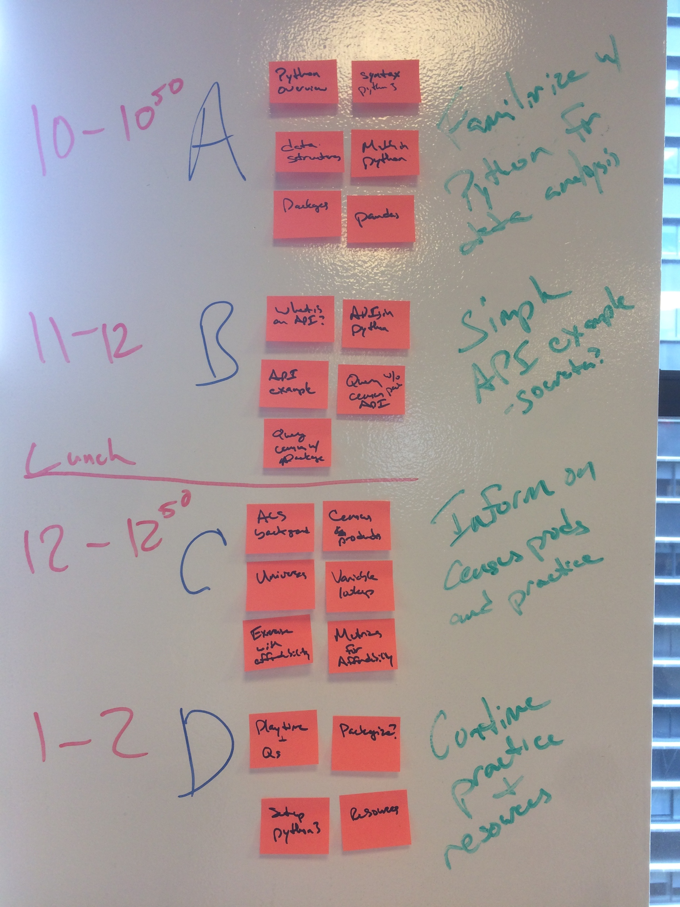

#Python for Accessing Census Demographic Data Online
##An introduction to the use of Python to query Census data through the API in order to faciliate easier access and use of Census data for analysis.

#Goals
+ Describe the basic syntax and usage of Python 3 for data analysis
+ Introduce key packages for Python to perform data analysis, including [pandas](http://pandas.pydata.org/), [requests](http://docs.python-requests.org/en/master/), and the [census](https://github.com/sunlightlabs/census)
+ Introduce application programming interfaces (APIs) and their use in data analysis
+ Discuss the various products released by the US Census Bureau and how to use them in analysis, with particularly focus on the [American Community Survey](https://www.census.gov/programs-surveys/acs/) 
+ Introduce the [Census APIs](http://www.census.gov/data/developers/data-sets.html) and practice accessing ACS data via the API to perform simple analysis
+ Practice using the Census APIs to reproduce the affordability index methodology in Python
+ Discuss key needs for a Census API wrapper to support the work of the GovEx team
+ Provide key resources for setting up Python and learning data analysis in Python 

#Key Outcomes
+ You will be familiar with basic syntax, data structures, and commonly used packages for data analysis in Python 3
+ You will be familiar with application programming interfaces (APIs) and how to work with them using Python
+ You will be familiar with the Census API for accessing ACS data with Python
+ You will be familiar with key resources to help further your understanding of Python for data analysis

#Outline
+ Getting started (10:00 - 10:50)
    + Python overview
    + Python 3 syntax
    + Key data structures in Python 3
    + Performing mathematical operations in Python
    + Introduction to packages in Python
    + Introduction to `pandas` package for data analysis
+ Morning break (10:50 - 11:00)
+ API overview (11:00 - 12:00)
    + What is an API?
    + Accessing APIs in Python
    + API example ([Socrata API](https://dev.socrata.com/consumers/getting-started.html))
    + Simple query of Census ACS API with `requests` package
    + Simple query of Census ACS API with `census` package
+ Lunch (with lecture)
+ Census overview and affordability index practical (12:00 - 12:50)
    + Overview of Census products
    + Background on ACS
    + Variable universes
    + Looking up variables and universes
    + Recreate affordability index
+ Afternoon break (12:50 - 1:00)
+ Practice and Wrap-up (1:00 - 2:00)
    + Continue with affordability recreation
    + Discussion on common metrics and necessary variables
    + Setting up Python 3 locally
    + Online resources
    + Questions and wrap-up

